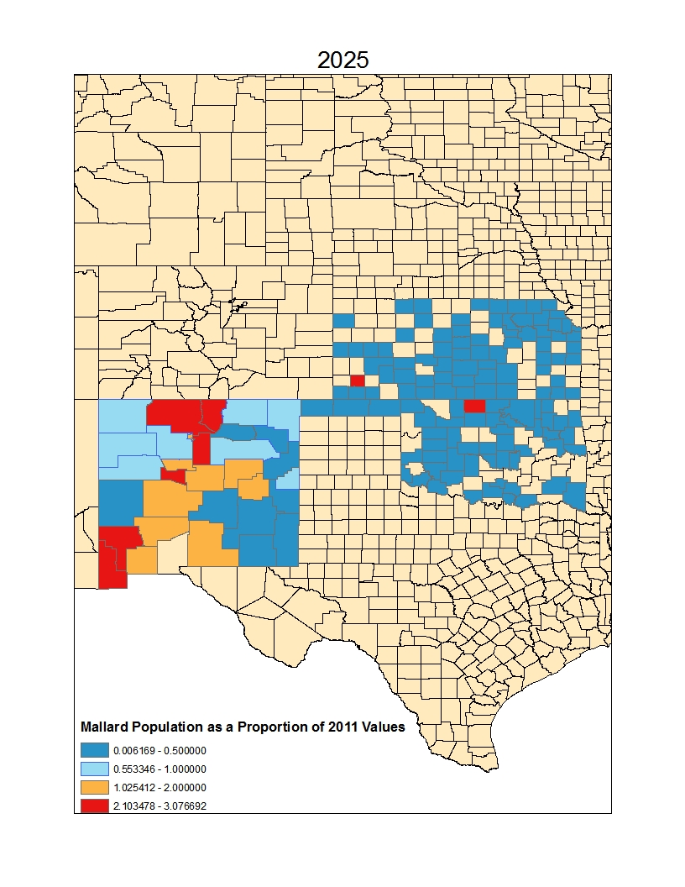
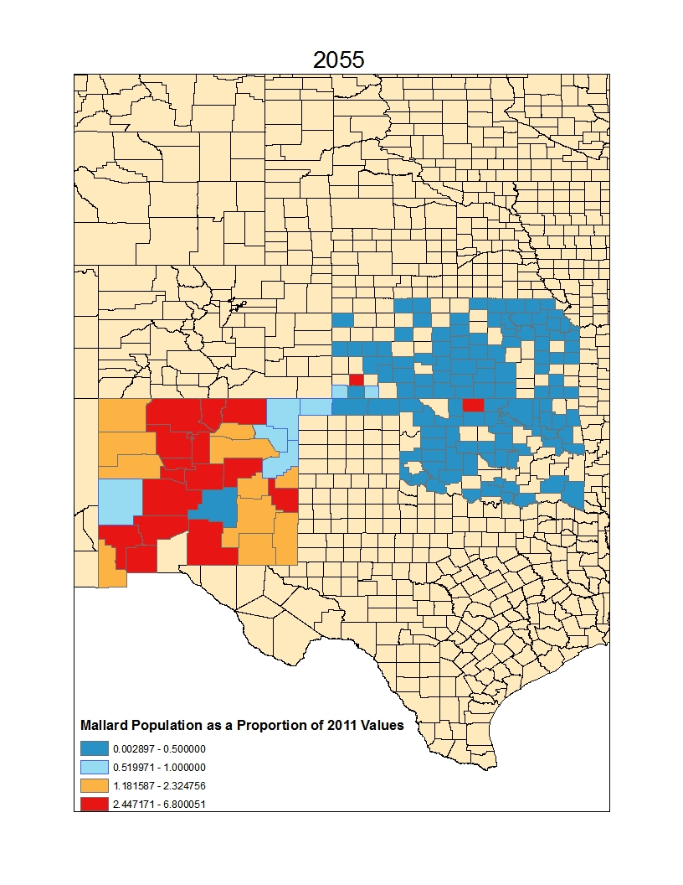
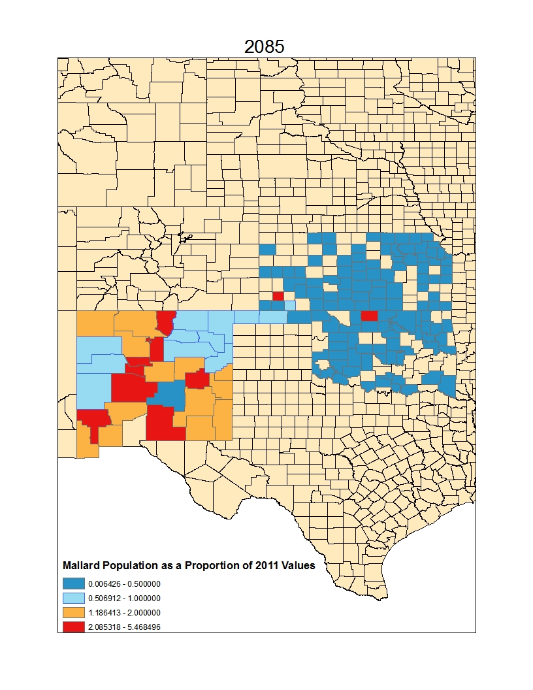

```{r setup, include=FALSE}
knitr::opts_chunk$set(echo = TRUE)
setwd("D:/Documents/RStudio/MyProject")
library(dplyr)
library(tidyr)
library(ggplot2)
library(stargazer)
library(stringr)
library(knitr)
library(pander)
```
```{r, echo = F}

```

**Introduction**

The rising threat of global warming chills the hearts of conservationists and environmentalists worldwide. Its tendrils reach forgotten corners of the globe, weaken ice shelves in the Arctic, disrupt currents in the depths of our oceans, and threaten our rich biodiversity with unprecedented extinction. But all of its effects are not so great and distant, some of its caused imbalances are small and local but no less for their relative magnitude. One such imbalance is that of the migrating waterfowl in the Great Plains, and that of their shrinking natural corridor. In the last few decades a multitude of migrating waterfowl species have experienced radically decreased population levels and constantly shifting population densities as a result of mistimed migration caused by shifting seasonal temperatures. Robins arrive in the Rocky Mountains before the snow has begun to melt, inhibiting their ability to nest and breed (Inouye, Barr, Armitage, & Inouye, 2000). Playas, small ephemeral wetlands that dot the shortgrass prairie, have begun to dry up, depriving weary waterfowl of their traditional resting grounds in midway through their cross-continental travels. For any meaningful conservation work to take place, these reductions in population must be documented and investigated so that informed conservancy and landscape design efforts can take place. Using the ebird database shifting avian populations of key wetland waterfowl species, as defined by state environmental action plans, documented through the decades by avid bird watchers will be compared against the last century of climate trends with the goal of determining which species are most at risk and have the greatest ability to be safeguarded against future warming trends.


Great plains waterfowl must contend with numerous threats to their dwindling populations. American wetlands that waterfowl rely on as resting and breeding ground have been drained, diminished, and desecrated in the centuries following European colonization. Once comprising 9% of the land area of the present range of the United States, roughly half of that original wetland range has been converted to other uses (Brinson & Malvárez, 2002). Those wetlands that remain face unceasing opposition to their continued existence including agricultural conversion, intermittent droughts, and rising global temperatures as a result of anthropogenic climate change (Johnson et al., 2005). As these wetlands shrink and fade, the migratory highway waterfowl depend on to sustain their journey becomes fragmented and disjointed. This migratory journey is further thrown into flux by rapidly changing climactic patterns due to anthropogenic climate change. As temperatures increase seasonal migration timings of affected bird species are thrown off, hindering ingrained breeding habits and reducing recruitment of new individuals to replenish their flagging populations (Butler, 2003).  


The breeding habits of threatened waterfowl species are most gravely injured, however, by the disappearance of shallow wetlands that serve as the most productive breeding grounds on the continent. These wetlands comprise only 10% of North American waterfowl breeding habitat, but account for the production of 50-80% of the continent's ducks (Covich et al., 1997). North American duck population in the Midwest have been shown to directly correlate with the number of ponded wetlands at the start of their breeding season (Johnson et al., 2005). These integral wetlands will continue to shrink as evapotranspiration rates climb due to increased temperatures in the area.


A useful method for gauging the damage done to waterfowl populations is to quantify damage done to the common mallard, Anas platyrhnchos. The common mallard is not only important to the upkeep of the playa ecosystem, but also provides an economic measure of playa wetlands through the birding and hunting industries. As one of the, if not the most hunted bird in the area, damage done to their populations by the shifting variables of climate change will represent tangible economic harm inflicted upon local economies. 


**Methods**

The reference dataset of bird counts maintained by the Ebird organization was subselected for counts of the common mallard for the period from its first recorded occurrence in 1953 for New Mexico, Kansas, and Oklahoma through to 2011. The resulting data set included 31,784 unique observations at 6,130 unique locations across the three states. These data were then subselected for observations with recorded effort hours, which were then used to standardize counts across observations. While this did change the data from counts rates, this method was selected as the best option to transform the data in a way that makes each point both comparable and usable towards the eventual goal of creating a predictive model. Climate data was generated with the ClimateNA v5.10 software package based on methodology described by Wang, Hamann, Spittlehouse, & Carroll, 2016. This data is comprised of interpolated climate data at 4km resolution based on the PRISM model for the 1901-2013 time period (Wang et al., 2016). 


These climate data were joined to the table of counts by year and location using the dplyR and tidyr packages (Wickham, 2014; Wickham & Francois, 2015). The resultant data were analyzed using a linear Poisson regression, and checked for influential outliers and residuals using Cook's Distance. Points classed as outliers (Cook's Distance > 4/number of observations) were removed, and the regression was ran again. This regression was subjected to stepwise analysis to reduce the number of significant variables in the model, which proved fruitless due to the large number of observations making it easy to detect a relatively small effect. The suite of climactic variables were then investigated for correlation with the count rate variable using the ecodist package (Goslee & Urban, 2007). Variables with absolute value correlations of less than 0.1 were removed, and stepwise analysis of the resulting regression was performed again. The model created with variables removed based upon correlation had a higher AIC value that the model that retained all the variables so the original model was kept.


Using this model projected expected 'counts' were predicted for 2025, 2055, and 2085 for each county in the three state area previously defined using averaged latitude and longitude coordinates for each county. These projected counts were then compared to predicted counts for 2011 based upon climate data, and changes in the prediction of observed mallard counts were mapped using ArcGIS.

```{r, echo = F}
load("projectdata.RData")


```


**Results**

All variables with the exception of FFP (frost-free period), eFFP (the day of the year on which FFP ends), and NFFD (the number of frost-free days) were found to be significant predictors of counted mallards (Table 1). Shown in table two are the four variables that were most highly correlated with counted mallards, and a 95% confidence interval for the strength of their effect.


At face value, this appears to be an excellent example of how a huge dataset can lead findings that could be best described as statistically significant insignificance. In the Table 2, we see that all of the climactic variable were significant (p-value < 0.05) predictors of the number of counted mallards. The effect sizes, however, were mostly small. This is to be expected, as a one unit increase in a majority of these variables constitutes a minute change. For example, per table 2 a one unit increase in MAP corresponds to an increase in the mean number of counted mallards by one percent! But that one unit increase represents a single millimeter of precipitation over the course of a year. Over the course of a year of rising temperatures, a multitude of warmer days would produce a much more significant drop in the number of counted mallards. Thus, looking at the positive and negative trends of these variable is potentially more useful than looking solely at the raw numbers. For those who wish to see the raw numbers, however, Table 3 shows the 95% confidence intervals for the exponentiated coefficients, or percent increase or decrease in mean counted mallards in Oklahoma, New Mexico, and Kansas.


```{r, echo = F}
Variables <- c("TD", "EXT", "MAP", "MSP")
Description <- c("Temperature difference between mean warmest month temperature (°C) and mean coldest month temperature (°C)", "Extreme maximum temperature over 30 years", "Mean annual precipitation (mm)", "May to September precipitation (mm)")
variable.table <- cbind(intervals, Description)
```


```{r, results='asis', echo = F}
stargazer(no.duck.model, single.row = T, header = F)
```


```{r, echo = F}
pander(variable.table, caption = "Most correlated Variables")
```

```{r, echo = F}
pander(intervals2, caption = "All Variables")
```


```{r, echo = F}
ggplot(duck.nooutlier, aes(EXT, count, col = EXT)) + geom_point() + 
  geom_smooth(method = "glm", se = F, method.args = list(family = "poisson")) + labs(title = "Increasing extreme maximum temperature increases counts", caption = "Fig 1. Increses in extreme temperature (C) increase counts.")
```


```{r, echo = F}
ggplot(duck.nooutlier, aes(TD, count, col = TD)) + geom_point() + 
  geom_smooth(method = "glm", se = F, method.args = list(family = "poisson")) + labs(caption = "Fig 2. More varied monthly temperatures (degree C differences) increases counts.", title = "An increase in mean monthly temperature variation increases counts")
```


Figures 1 and 2 both show an increase in counts as a function of increasing temperature. Of particular interest is the increase in counts due to increased temperature variation. More extreme seasonality is a classic hallmark of the effects of climate change. Extreme summers and extreme winters have impacted and will probably continue to impact the counted populations of mallards in Oklahoma, New Mexico, and Kansas. As summers and winters grow more extreme, this variable may represent an ability to resist climatic swings for our feathery friends.


```{r, echo = F}
ggplot(duck.nooutlier, aes(MAP, count, col = MAP)) + geom_point() + 
  geom_smooth(method = "glm", se = F, method.args = list(family = "poisson")) + labs(caption = "Fig 3. An increase in mean annual precipitation (mm) increases counts.", title = "Increasing precipitation increases counts")
```


```{r, echo = F}
ggplot(duck.nooutlier, aes(MSP, count, col = MSP)) + geom_point() + 
  geom_smooth(method = "glm", se = F, method.args = list(family = "poisson")) + labs(caption = "Fig 4. An increase in Spring-Summer precipitation (mm) increases counts.", title = "Increasing precipitation further increases counts")
```


Figures 3 and 4 show the effects of the main precipitation variables. Unsurprisingly, increased May to September precipitation (MSP) positively effects the number of counted mallards as shown in Figure 5. The small effect size of both of these variables is explained by the fact that they are measured in millimeters. 








**Discussion**

  It is unsurprising that two of the variables most highly correlated with mallard counts are precipitation variables. Precipitation is key to maintaining mallard populations in the Great Plains and using annual variables exclusively represents that general idea strongly. It would be interesting to investigate the relationship between monthly variables in the future, as playa wetlands have the ability to pond and retain water for long periods of time. This means annual precipitation and May-September precipitation may be less informative of trends in counts relative to monthly variables. A closer look at monthly precipitation as compared against background monthly count trends could show in which moths water is most impactful, and inform future conservation priorities.


  The difference in the effects of climate change on mallard populations is especially interesting when compared between states. Figure 5, 6, and 7 show that New Mexico is poised for an increase in counted mallards in 2025, 255, and 285 as compared to recorded 2011 counts, whereas Kansas and New Mexico are projected to experience decreased counts as compared to 2011. This suggests that state-specific climactic models may be of use in further investigation, in order to develop a more specific, informed predictions. This is especially true since the model generally shows trends towards increasing mallard counts. It would be useful to know whether those trends are region wide, or whether the relatively large amount of data coming from New Mexico is positively skewing the model. 
  
    Kansas and Oklahoma show a pretty uniform decrease in counts compared to 2011 in all future projections, which should direct waterfowl conservation efforts towards those states rather than New Mexico. A preemptive increase in the number of ponding wetlands in the area could stiffen resilience in the face of these shifting climactic trends. It is interesting that projected counts in New Mexico start off heavily reduced in 2025, but begin to recover and thrive from there on out. Investigation of the drivers of New Mexican resistance could prove enlightening.


**References**

Brinson, M. M., & Malvárez, A. I. (2002). Temperate freshwater wetlands: types, status, and threats. Environmental Conservation, 29(2), 115-133. http://doi.org/10.1017/S0376892902000085

Butler, C. J. (2003). The disproportionate effect of global warming on the arrival dates of short-distance migratory birds in North America. Ibis, 145(3), 484-495. http://doi.org/10.1046/j.1474-919X.2003.00193.x

Covich, A. P., Fritz, S. C., Lamb, P. J., Marzolf, R. D., Matthews, W. J., Poiani, K. A., . Winter, T. C. (1997). Potential effects of climate change on aquatic ecosystems of the Great Plains of North America. Hydrological Processes, 11(8), 993-1021. http://doi.org/10.1023/A

Hlavac, Marek (2015). stargazer: Well-Formatted Regression and Summary Statistics Tables. R package version
  5.2. http://CRAN.R-project.org/package=stargazer

Inouye, D. W., Barr, B., Armitage, K. B., & Inouye, B. D. (2000). Climate change is affecting altitudinal migrants and hibernating species. Proceedings of the National Academy of Sciences of the United States of America, 97(4), 1630-3. http://doi.org/10.1073/PNAS.97.4.1630

IUCN. (2016). The IUCN Red List of Threatened Species.

Johnson, W. C., Millett, B. V., Gilmanov, T., Voldseth, R. A., Guntenspergen, G. R., Naugle, D. E., . CA, W. (2005). Vulnerability of Northern Prairie Wetlands to Climate Change. BioScience, 55(10), 863. http://doi.org/10.1641/0006-3568(2005)055[0863:VONPWT]2.0.CO;2

Nixon, A., Fisher, R., Stralberg, D., & Bayne, E. (2015). Projected responses of Alberta grassland songbirds to climate change.

Wang, T., Hamann, A., Spittlehouse, D., & Carroll, C. (2016). Locally downscaled and spatially customizable climate data for historical and future periods for North America. PLoS ONE, 11(6), 1-17. http://doi.org/10.1371/journal.pone.0156720

Wickham, H. and Francois, R. (2016). dplyr: A Grammar of Data Manipulation. R package version 0.5.0.
  https://CRAN.R-project.org/package=dplyr

Wickham, H. (2009) ggplot2: Elegant Graphics for Data Analysis. Springer-Verlag New York.

Wickham, H. (2016). tidyr: Easily Tidy Data with `spread()` and `gather()` Functions. R package version
  0.6.0. https://CRAN.R-project.org/package=tidyr
